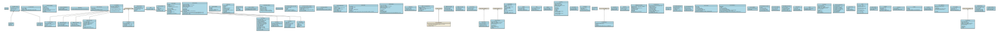

# GOVUK React Components Library

[](https://github.com/LandRegistry/govuk-react-components-library/releases)
[](https://www.npmjs.com/package/@hmlr/govuk-react-components-library)
[](https://www.npmjs.com/package/govuk-frontend)
[](https://github.com/LandRegistry/govuk-react-components-library/blob/main/.nvmrc)
[](https://github.com/LandRegistry/govuk-react-components-library/blob/main/LICENCE)

This project is a collection of React components built based on [GDS Specifications](https://design-system.service.gov.uk/get-started/production/). The components are designed to be reused by applications, with a focus on providing consistent and accessible user experiences. The components are based on the [govuk-frontend](https://frontend.design-system.service.gov.uk/) library, ensuring compatibility and adherence to the UK Government's digital design standards.

**Disclaimer**

:warning: **This project is not officially supported by the Government Digital Service (GDS). It is maintained on a best-efforts basis by the HM Land Registry (HMLR) only. While we strive to ensure the accuracy and reliability of the code, we cannot guarantee its full compliance with GDS standards or the availability of ongoing support.**

## Installation

Then install this component library:

```bash
npm install @hmlr/govuk-react-components-library
```

## Components

Note that any component with a `👈🏽` below means that - This component will need javascript to be enabled because of the transitions present in the components using `createAll` or `initAll` recommended by [`govuk-frontend` documentation](https://frontend.design-system.service.gov.uk/configure-components/)

The Components includes:

- [Accordion](./src/components/Accordion/Accordion.tsx) `👈🏽`
- [Boolean](./src/components/Boolean/Boolean.tsx)
- [Breadcrumbs](./src/components/Breadcrumbs/Breadcrumbs.tsx)
- [Button](./src/components/Button/Button.tsx) `👈🏽`
- [CharacterCount](./src/components/CharacterCount/CharacterCount.tsx)
- [CheckBoxes](./src/components/Checkboxes/Checkboxes.tsx) `👈🏽`
- [CookieBanner](./src/components/CookieBanner/CookieBanner.tsx)
- [DateInput](./src/components/DateInput/DateInput.tsx)
- [Details](./src/components/Details/Details.tsx)
- [ErrorMessage](./src/components/ErrorMessage/ErrorMessage.tsx)
- [ErrorSummary](./src/components/ErrorSummary/ErrorSummary.tsx) `👈🏽`
- [Fieldset](./src/components/Fieldset/Fieldset.tsx)
- [FileUpload](./src/components/FileUpload/FileUpload.tsx)
- [Footer](./src/components/Footer/Footer.tsx)
- [Header](./src/components/Header/Header.tsx) `👈🏽`
- [Hint](./src/components/Hint/Hint.tsx)
- [Input](./src/components/Input/Input.tsx)
- [InsetText](./src/components/InsetText/InsetText.tsx)
- [Label](./src/components/Label/Label.tsx)
- [NotificationBanner](./src/components/NotificationBanner/NotificationBanner.tsx)
- [Pagination](./src/components/Pagination/Pagination.tsx)
- [Panel](./src/components/Panel/Panel.tsx)
- [PhaseBanner](./src/components/PhaseBanner/PhaseBanner.tsx)
- [Radios](./src/components/Radios/Radios.tsx) `👈🏽`
- [Select](./src/components/Select/Select.tsx)
- [ServiceNavigation](./src/components/ServiceNavigation/ServiceNavigation.tsx)
- [SkipLink](./src/components/SkipLink/SkipLink.tsx) `👈🏽`
- [SummaryList](./src/components/SummaryList/SummaryList.tsx)
- [Table](./src/components/Table/Table.tsx)
- [Tabs](./src/components/Tabs/Tabs.tsx) `👈🏽`
- [Tag](./src/components/Tag/Tag.tsx)
- [TaskList](./src/components/TaskList/TaskList.tsx)
- [Textarea](./src/components/Textarea/Textarea.tsx)
- [WarningText](./src/components/WarningText/WarningText.tsx)

There are Also Several components that can be used for error processing and other functionality like dashboard display:
Note that some of the components below with `👈🏽` - Means like the above components, javascript needs to be enabled.

- [CardColumn](./src/components/CardColumn/CardColumn.tsx)
- [CardLayout](./src/components/CardLayout/CardLayout.tsx)
- [DataNavigation](./src/components/DataNavigation/DataNavigation.tsx)
- [DifferenceNavigation](./src/components/DifferenceNavigation/DifferenceNavigation.tsx) - Read [Documentation](./src/components/DifferenceNavigation/README.md) to see usage
- [ErrorBoundary](./src/components/ErrorBoundary/ErrorBoundary.tsx)
- [Landing](./src/components/Landing/Landing.tsx)
- [Loading](./src/components/Loading/Loading.tsx)
- [Main](./src/components/Main/Main.tsx)
- [NotFoundPage](./src/components/NotFoundPage/NotFoundPage.tsx)
- [PDFViewer](./src/components/PDFViewer/PDFViewer.tsx)
- [PDFViewerCanvas](./src/components/PDFViewerCanvas/PDFViewerCanvas.tsx) - Read [Documentation](./src/components/PDFViewerCanvas/README.md) to see usage
- [ProblemWithService](./src/components/ProblemWithService/ProblemWithService.tsx) `👈🏽` - `createAll(ErrorSummary..)` or `ConfigureOverallErrorSummary()`
- [WarningInfo](./src/components/WarningInfo//WarningInfo.tsx)

There are also some useful components :

- [ActionLink](./src/components/ActionLink/ActionLink.tsx)
- [BackLink](./src/components/BackLink/BackLink.tsx)
- [LinkWithRef](./src/components/LinkWithRef/LinkWithRef.tsx)
- [Loading](./src/components/Loading/Loading.tsx)
- [Main](./src/components/Main/Main.tsx)

There are some convenience functions that can be used to configure components with `👈🏽` mentioned above.

- [ExtractAccordionConfigFromAttributes](./src/components/Accordion/Accordion.config.tsx) - Extracts Accordion configurations from fixtures attributes e.g. `showAllSectionsText` translates to `showAllSections` in `AccordionConfig`.
- [ConfigureOverallAccordion](./src/components/Accordion/Accordion.config.tsx) - Sets overall behavior and configurations for all accordions or in a scope (document or specified element) as per [govuk-frontend accordion api reference](https://frontend.design-system.service.gov.uk/javascript-api-reference/#accordion).
- [ConfigureOverallButton](./src/components/Button/Button.config.tsx) - Sets overall behavior and configurations for all button or in a scope (document or specified element) as per [govuk-frontend button api reference](https://frontend.design-system.service.gov.uk/javascript-api-reference/#button).
- [ConfigureOverallCheckboxes](./src/components/Checkboxes/Checkboxes.config.tsx) - Sets overall behavior and configurations for all checkboxes or in a scope.
- [ConfigureOverallErrorSummary](./src/components/ErrorSummary/ErrorSummary.config.tsx) - Sets overall behavior and configurations for all error summary or in a scope (document or specified element) as per [govuk-frontend error-summary api reference](https://frontend.design-system.service.gov.uk/javascript-api-reference/#errorsummary).
- [ConfigureOverallHeader](./src/components/Header/Header.config.tsx) - Sets overall behavior and configurations for all Header or in a scope.
- [ConfigureOverallRadios](./src/components/Radios/Radios.config.tsx) - Sets overall behavior and configurations for all Radios or in a scope.
- [ConfigureOverallSkipLink](./src/components/SkipLink/SkipLink.config.tsx) - Sets overall behavior and configurations for all SkipLink or in a scope.
- [ConfigureOverallTabs](./src/components/Tabs/Tabs.config.tsx) - Sets overall behavior and configurations for all Tabs or in a scope.

Here are some examples of the above convenient configurations functions:

<details>
  <summary>Scoped Accordion Configuration Example</summary>

```javascript
// in scope accordion configuration
import React, { useEffect } from "react";
import {
  ConfigureOverallAccordion,
  ExtractAccordionConfigFromAttributes,
} from "@hmlr/govuk-react-components-library";

function App() {
  useEffect(() => {
    const attributes = {
      hideAllSectionsText: "Collapse all sections",
      showAllSectionsText: "Expand all sections",
      hideSectionText: "Collapse",
      hideSectionAriaLabelText: "Collapse this section",
      showSectionText: "Expand",
      showSectionAriaLabelText: "Expand this section",
    };
    const accordionConfig = ExtractAccordionConfigFromAttributes(attributes);
    const $element = document.querySelector(".govuk-accordion");
    ConfigureOverallAccordion($element, accordionConfig);
  }, []);

  return (
    <Accordion
      id="default-example"
      items={[
        {
          content: {
            children:
              "We need to know your nationality so we can work out which elections you’re entitled to vote in. If you cannot provide your nationality, you’ll have to send copies of identity documents through the post.",
          },
          heading: {
            children: "Section A",
          },
        },
        {
          content: {
            children: [
              <ul key="0" className="govuk-list govuk-list--bullet">
                {""}
                <li>Example item 2</li>
              </ul>,
              "\n",
            ],
          },
          heading: {
            children: "Section B",
          },
        },
      ]}
    />
  );
}
```

or

```javascript
// in scope accordion configuration
import React, { useEffect } from "react";
import {
  Accordion,
  ConfigureOverallAccordion,
} from "@hmlr/govuk-react-components-library";

function App() {
  useEffect(() => {
    const accordionConfig = {
      i18n: {
        hideAllSections: "Collapse all sections",
        showAllSections: "Expand all sections",
        hideSection: "Collapse",
        hideSectionAriaLabel: "Collapse this section",
        showSection: "Expand",
        showSectionAriaLabel: "Expand this section",
      },
    };
    const $element = document.querySelector(".govuk-accordion");
    ConfigureOverallAccordion($element, accordionConfig);
  }, []);

  return (
    <Accordion
      id="default-example"
      items={[
        {
          content: {
            children:
              "We need to know your nationality so we can work out which elections you’re entitled to vote in. If you cannot provide your nationality, you’ll have to send copies of identity documents through the post.",
          },
          heading: {
            children: "Section A",
          },
        },
        {
          content: {
            children: [
              <ul key="0" className="govuk-list govuk-list--bullet">
                {""}
                <li>Example item 2</li>
              </ul>,
              "\n",
            ],
          },
          heading: {
            children: "Section B",
          },
        },
      ]}
    />
  );
}
```

</details>

<details>
  <summary>Scoped Accordion Configuration Example in HTML</summary>

```html
<!-- in scope accordion configuration -->
<script type="module" src="./govuk-frontend.min.js"></script>
<script type="module">
  import { Accordion, createAll } from "./govuk-frontend.min.js";
  const $accordion = document.querySelector(".govuk-accordion");
  createAll(
    Accordion,
    {
      i18n: {
        hideAllSections: "Collapse all sections",
        showAllSections: "Expand all sections",
        hideSection: "Collapse",
        hideSectionAriaLabel: "Collapse this section",
        showSection: "Expand",
        showSectionAriaLabel: "Expand this section",
      },
    },
    $accordion,
  );
</script>
```

or

```html
<!-- in scope accordion configuration -->
<script type="module" src="./govuk-frontend.min.js"></script>
<script type="module">
  import { Accordion } from "./govuk-frontend.min.js";
  const $accordions = document.querySelectorAll(
    '[data-module="govuk-accordion"]',
  );
  $accordions.forEach(($accordion) => {
    new Accordion($accordion, {
      i18n: {
        hideAllSections: "Collapse all sections",
        showAllSections: "Expand all sections",
        hideSection: "Collapse",
        hideSectionAriaLabel: "Collapse this section",
        showSection: "Expand",
        showSectionAriaLabel: "Expand this section",
      },
    });
  });
</script>
```

</details>

<details>
  <summary>Use default Accordion Configurations</summary>

```javascript
// use default configuration
import React, { useEffect } from "react";
import {
  Accordion,
  ConfigureOverallAccordion,
} from "@hmlr/govuk-react-components-library";

function App() {
  useEffect(() => {
    ConfigureOverallAccordion();
  }, []);

  return (
    <Accordion
      id="default-example"
      items={[
        {
          content: {
            children:
              "We need to know your nationality so we can work out which elections you’re entitled to vote in. If you cannot provide your nationality, you’ll have to send copies of identity documents through the post.",
          },
          heading: {
            children: "Section A",
          },
        },
        {
          content: {
            children: [
              <ul key="0" className="govuk-list govuk-list--bullet">
                {""}
                <li>Example item 2</li>
              </ul>,
              "\n",
            ],
          },
          heading: {
            children: "Section B",
          },
        },
      ]}
    />
  );
}
```

or in html

```html
<!-- use default configuration -->
<script type="module" src="./govuk-frontend.min.js"></script>
<script type="module">
  import { Accordion, createAll } from "./govuk-frontend.min.js";
  createAll(Accordion);
</script>
```

</details>

<details>
  <summary>Use default All Configurations</summary>

```javascript
// use default configuration
import React, { useEffect } from "react";
import { initAll } from "govuk-frontend";
import { Accordion } from "@hmlr/govuk-react-components-library";

function App() {
  useEffect(() => {
    initAll();
  }, []);

  return (
    <Accordion
      id="default-example"
      items={[
        {
          content: {
            children:
              "We need to know your nationality so we can work out which elections you’re entitled to vote in. If you cannot provide your nationality, you’ll have to send copies of identity documents through the post.",
          },
          heading: {
            children: "Section A",
          },
        },
        {
          content: {
            children: [
              <ul key="0" className="govuk-list govuk-list--bullet">
                {""}
                <li>Example item 2</li>
              </ul>,
              "\n",
            ],
          },
          heading: {
            children: "Section B",
          },
        },
      ]}
    />
  );
}
```

or in html

```html
<!-- use default configuration -->
<script type="module" src="./govuk-frontend.min.js"></script>
<script type="module">
  import { initAll } from "./govuk-frontend.min.js";
  initAll();
</script>
```

</details>

## Usage

Use the above components like the Panel component:

```javascript
import { Panel } from "@hmlr/govuk-react-component-library";

export default function SuccessPanel() {
  return (
    <Panel titleChildren="Application complete">
      Your reference number: HDJ2123F
    </Panel>
  );
}
```

**Customizing components**

You can customize the appearance and behavior of components by passing props:

```jsx
import { Button } from "@hmlr/govuk-react-component-library";

export default function CustomButton() {
  return (
    <Button variant="warning" onClick={() => alert("Button clicked!")}>
      Custom Button
    </Button>
  );
}
```

Note: For the `PDFViewer` above you must provide a [PDFJS Distribution version](https://mozilla.github.io/pdf.js/) to be used along with the `PDFViewer` component. follow the steps to use `PDFViewer` component:

- Download any version of the [PDFJS Distribution version](https://mozilla.github.io/pdf.js/) suitable for your application
- Unzip the distribution and add it into you project's static directory i.e. `public` directory. Meaning in the root of your project you will have the distribution in `public/pdfjs-4.4.168-dist`
- Use the viewer located in `public/pdfjs-4.4.168-dist/web/viewer.html` as `viewerLocation` value in the `PDFViewer` component. Meaning since `public` is the static directory the viewer is located in `/pdfjs-4.4.168-dist/web/viewer.html`.

An example of the `PDFViewer` component usage based on the 3 steps above will be:

```jsx
import {
  PDFViewer,
  PDFViewerBackend,
} from "@hmlr/govuk-react-component-library";

export default function ViewDocument() {
  return (
    <PDFViewer
      backend={PDFViewerBackend}
      documentName="LCOP 2020-0035"
      iframeId="document_iframe"
      src="/document.pdf"
      toolbar="fullHidePrint"
      viewerLocation="/pdfjs-4.4.168-dist/web/viewer.html"
    />
  );
}
```

or base64 encoded pdf data

```jsx
import {
  PDFViewer,
  PDFViewerBackend,
} from "@hmlr/govuk-react-component-library";
import { base64EncodedPDFDocument } from "./testutilities/SampleBase64";

export default function ViewDocument() {
  return (
    <PDFViewer
      backend={PDFViewerBackend}
      documentName="LCOP 2020-0035"
      iframeId="document_iframe"
      src={base64EncodedPDFDocument}
      toolbar="fullHidePrint"
      viewerLocation="/pdfjs-4.4.168-dist/web/viewer.html"
    />
  );
}
```

Also one can add custom javascript to viewer to hide or show certain parts of the PDF Viewer or any custom functionality. An example is in the [Custom Toolbar](./.storybook/public/customToolbar.js) in this project. Which then means that in the [`PDF Viewer`](./.storybook/public/pdfjs-4.4.168-dist/web/viewer.html#L40). one will add

```html
<script src="../../customToolbar.js"></script>
```

to the head tag of the `./.storybook/public/pdfjs-4.4.168-dist/web/viewer.html` file.

But for the example above we recommend to use the [Custom Toolbar](./.storybook/public/customToolbar.js) in this project. This is tested against `/pdfjs-4.4.168-dist` only. Copy [Custom Toolbar](./.storybook/public/customToolbar.js) into your project static folder where it is called `public` and the use it in the `public/pdfjs-4.4.168-dist/web/viewer.html` thus:

```html
<head>
  .....
  <script src="../../customToolbar.js"></script>
</head>
```

## Using this library

In order to use this library, you will need to install the peer dependencies of this application as show in the [package.json.peerDependencies](./package.json#139). Which includes the following dependencies:

- [govuk-frontend](https://www.npmjs.com/package/govuk-frontend) - any version >=5.6.0
- [react](https://www.npmjs.com/package/react) - any version >=18.3.1
- [react-dom](https://www.npmjs.com/package/react-dom) - any version >=18.3.1
- [react-router-dom](https://www.npmjs.com/package/react-router-dom) - any version >=6.26.1

The source of truth can be found the [package.json.peerDependencies](./package.json#139).

### Using the PDFViewerCanvas Component

The PDFViewerCanvas component is optional and requires the `pdfjs-dist` package. To use it:

1. Install the optional dependency:

```bash
npm install pdfjs-dist
```

- [pdfjs-dist](https://www.npmjs.com/package/pdfjs-dist) - any version >=4.6.82 and only if you are using `PDFViewerCanvas` component. This is an optional dependency.

2. Import the PDFViewerCanvas component from the separate entry point:

```jsx
import { PDFViewerCanvas } from "@hmlr/govuk-react-components-library/pdfViewer";
```

3. Use the component in your React application:

```jsx
<PDFViewerCanvas src="path/to/your/pdf" />
```

## Development

### Prerequisites

- Node.js ( v20.19.0 or higher)
- npm ( v10.8.2 or higher)
- govuk-frontend (v5.8.0 or higher)
- react (v18.2.0 or higher)
- react-dom (v18.2.0 or higher)
- react-router-dom (v18.2.0 or higher)

### Setup

1. Clone the repository:

```bash
git clone https://github.com/LandRegistry/govuk-react-component-library.git
cd govuk-react-component-library
```

2. Install dependencies:

```bash
npm install
npm install pdfjs-dist@4.10.38 --save-dev # for PDFCanvas
```

3. Start the development server:

```bash
npm run dev
```

4. Run Storybook:

```bash
npm run storybook
```

### Running Builds

To run the build in this project use the following command:

```bash
npm run build
```

### Running Linting and formatting

To run the linting and formating in this project use the following command:

```bash
npm run lint
```

or

```bash
npm run lint-fix
```

and for prettifying

```bash
npm run format
```

## Testing

To run the test in this project use the following command:

```bash
npm run test
```

## Contributing

Contributions are welcome! Please feel free to submit a Pull Request.

## UML Diagram

The UML diagram for all components in this library can be found here:



## Release New version of this package

Use the floowing command to release a new version of the application

```bash
npm run release
```

or

```bash
npm run release -- --release-as minor
```

or for specific versions

```bash
npm run release -- --release-as 1.9.1
```

Then publish the version with the following command

```bash
git push --follow-tags origin main
```

and publish as an npm package run

```bash
npm publish
```

## License

This project is licensed under the MIT License - see the LICENSE file for details.
